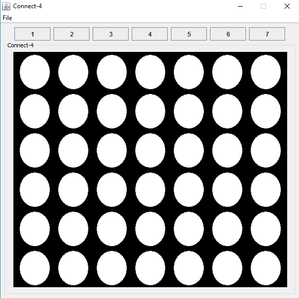
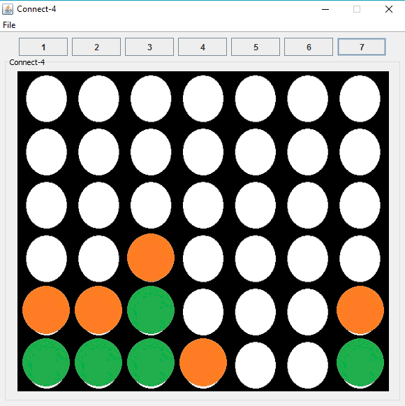
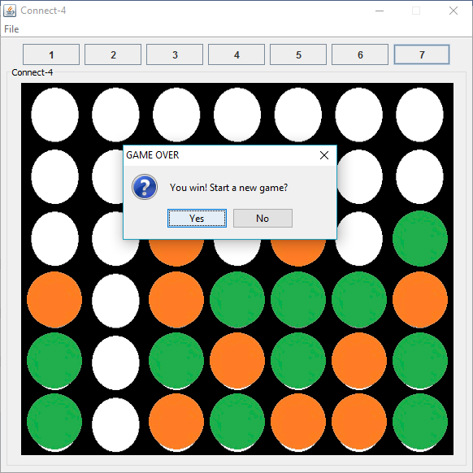
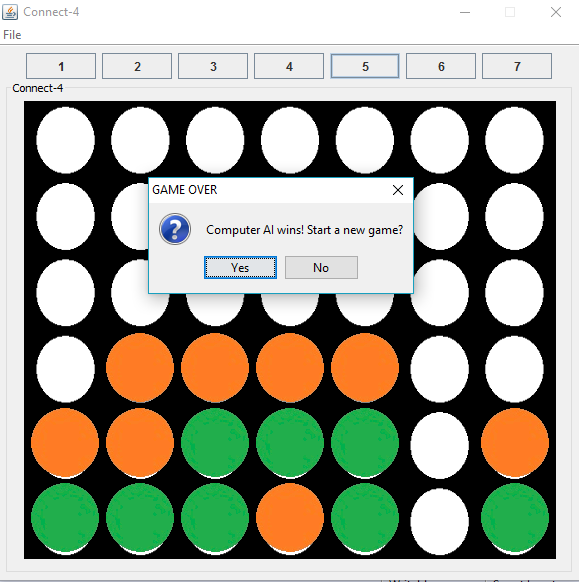

# connect-4
An artifical intelligence project using minmax alpha-beta pruning algorithm. who first able to connect four dots vertically, horizontally, diagonally wins!
<body>

    
    
    
    

  
</body>
